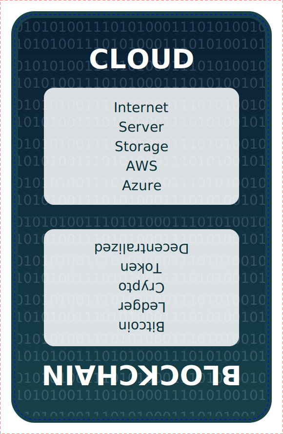

# Tech Taboo Card Generator

This project is a simple web-based generator for creating printable "Taboo"-style cards with a tech twist. Enter your own words and taboo terms, and instantly generate a double-sided SVG card suitable for printing or sharing.

## Features

- **Easy Input:** Enter two lines, each with a word to guess and five taboo words.
- **Instant Preview:** See your card rendered as an SVG in real time.
- **Download Options:** Save your card as SVG or PNG for printing or digital use.
- **Tech-Themed Design:** Stylish, modern card layout with a subtle binary background.

## How to Use

1. Open [`tech-taboo-generator.html`](tech-taboo-generator.html) in your browser.
2. Enter your words in the following format:
```
WordToGuess1 | taboo1, taboo2, taboo3, taboo4, taboo5 WordToGuess2 | taboo1, taboo2, taboo3, taboo4, taboo5
```
3. Click **Generate Card** to preview.
4. Click **Save as SVG** or **Save as PNG** to download your card.

## Example

Below is an example of a generated card ([`card-example.svg`](card-example.svg)):



## Files

- [`tech-taboo-generator.html`](tech-taboo-generator.html): Main web app for generating cards.
- [`card-example.svg`](card-example.svg): Example output card.
- [`README.md`](README.md): Project documentation.

---

Enjoy making your own tech-themed taboo cards!

## System Cards

## Synergy Map

